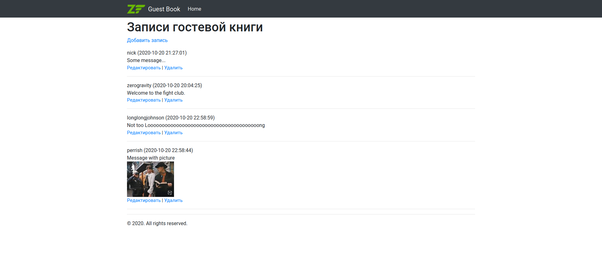
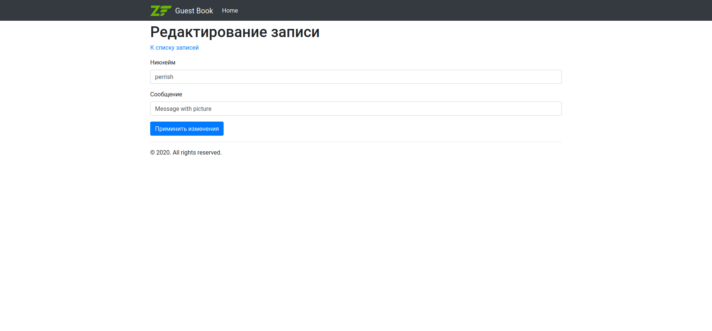
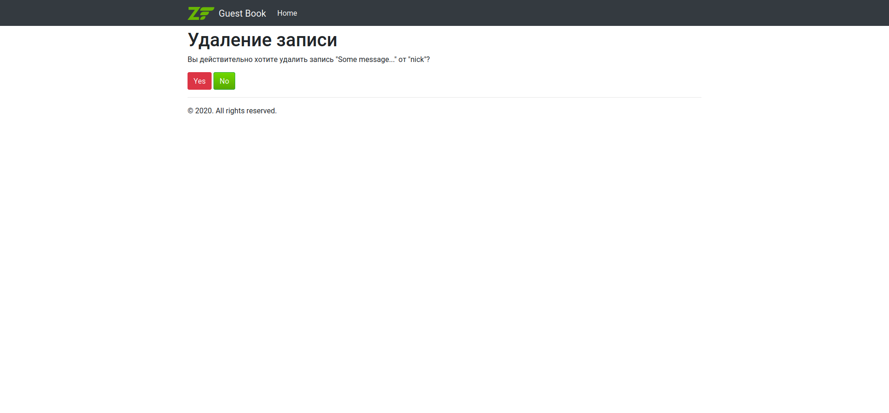

### Для запуска проекта

* убедитесь, что все зависимости проинициализированы
  composer install
* cоздайте таблицу в mysql
  CREATE TABLE note (id INT PRIMARY KEY AUTO_INCREMENT NOT NULL, nickname VARCHAR(100), date_created DATETIME, msg TEXT NOT NULL, img blob);
* поправьте файл **GuestBook\config\autoload\global.php** вашими данными для доступа к mysql

```
cd GuestBook
php -S 0.0.0.0:8080 -t public
```

### Вы должны увидеть это





